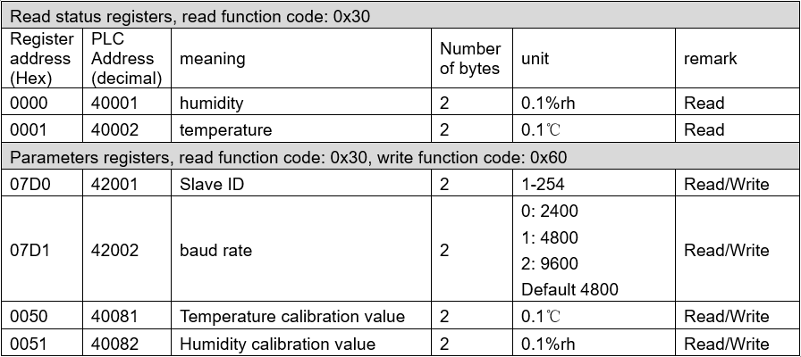
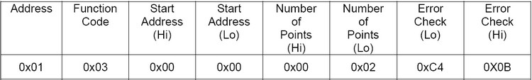
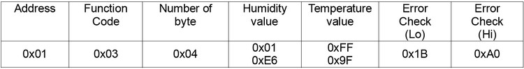
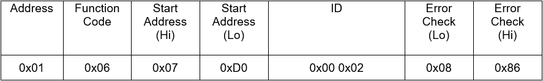
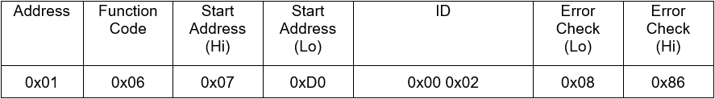
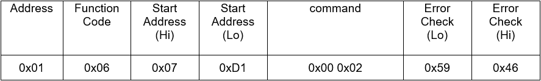
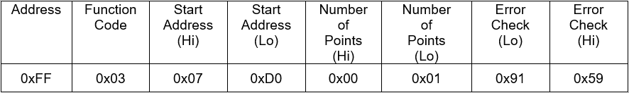
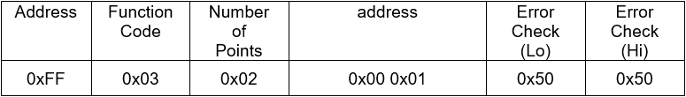

# CWT-TH01S

**RS485 Modbus Water Proof Temperature Humidity Sensor Probe**

https://www.aliexpress.com/item/1005001404952412.html?spm=a2g0o.detail.1000014.9.29162c048oUA5v&gps-id=pcDetailBottomMoreOtherSeller&scm=1007.40050.281175.0&scm_id=1007.40050.281175.0&scm-url=1007.40050.281175.0&pvid=d833c160-1885-48d7-8094-82328fbb0317&_t=gps-id:pcDetailBottomMoreOtherSeller,scm-url:1007.40050.281175.0,pvid:d833c160-1885-48d7-8094-82328fbb0317,tpp_buckets:668%232846%238111%231996&pdp_ext_f=%7B%22sku_id%22%3A%2212000026105836717%22%2C%22sceneId%22%3A%2230050%22%7D&pdp_npi=2%40dis%21EUR%217.73%217.73%21%21%21%21%21%400b0a23a416607662172067140e5f73%2112000026105836717%21rec

https://store.comwintop.com/products/rs485-modbus-water-proof-temperature-humidity-sensor-probe?variant=42131365757155

**Wiring**

| **Cable color**     | **Description**  |
| ------------------- | ---------------- |
| Brown               | Power +(DC5-30V) |
| black               | Power -          |
| Yellow （or green） | RS485 A+         |
| Blue                | RS485 B-         |

RS485 communication Default
parameters: 4800,n,8,1

Default device address is 1

Modbus RTU protocol

E.g. master read temperature humidity:

Sensor responds:

Temperature calculates:

When temperature less than 0, value will be responded in complement 

Temperature: FF9F H= -97 => temperature= -9.7℃

hex to `int16_t`

Humidity: 1E6 H= 486 => humidity= 48.6%

**Set slave ID**

E.g., set slave ID=2, Master sends

Sensor responds:

**Set baud rate**

E.g., set baud rate to 9600, Master sends

Sensor responds:

**Enquiry slave ID**

Master sends

Sensor responds:

