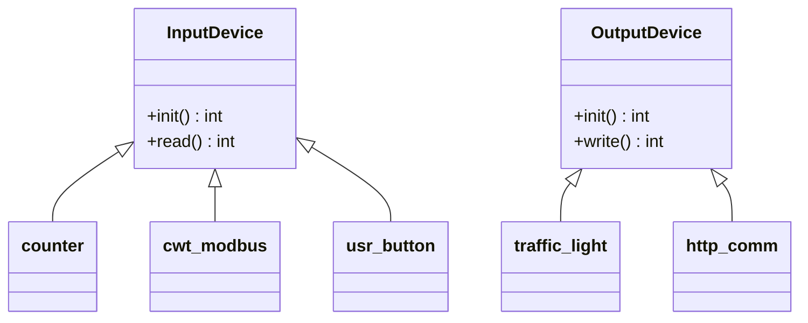

# Notes

## TODO

- [x] CMake preset for rpi compilation
- [x] Return codes - error handling
- [ ] Logging stdout - file - (to db over http)

modbus make it a singleton context

all sensors could inherit from same base class

## Design

## Extern

* https://github.com/fmtlib/fmt
* https://github.com/sqlite/sqlite
* https://github.com/joan2937/pigpio
* https://github.com/stephane/libmodbus
* https://github.com/curl/curl
* https://libgpiod.readthedocs.io/en/latest/

