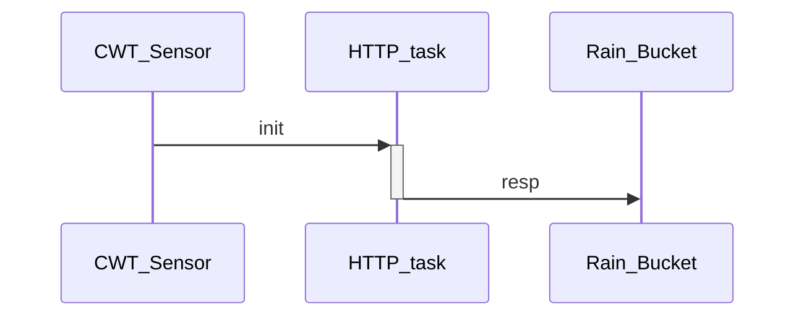

# MeteoMan-Station


## Raspberry setup

**raspi-config**

```sh
sudo raspi-config
	3 Interface Options
		I6 Serial Port
			login shell <No>
			hardware enable <Yes>
	5 Localisation Options
		L2 Timezone
```


add usr libs to [ldconfig](https://linux.die.net/man/8/ldconfig)

```sh
# check 
sudo ldconfig -v |grep /usr/local/lib
# add if not available
sudo ldconfig /usr/local/lib
```


**gpiod**

```shell
#for libs
sudo apt install gpiod
#for dev
sudo apt install libgpiod-dev
```


**libcurl**

https://curl.se/libcurl/c/http-post.html

```bash
#for libs
sudo apt install libcurl4
#for dev
sudo apt install libcurl4-openssl-dev
```


**libmodbus**

https://libmodbus.org/getting_started/

```bash
#for libs
sudo apt install libmodbus5
#for dev
sudo apt install libmodbus-dev

or

wget https://github.com/stephane/libmodbus/releases/download/v3.1.8/libmodbus-3.1.8.tar.gz
tar -xvf libmodbus-3.1.8.tar.gz
cd libmodbus-3.1.8
./configure
make
sudo make install
```


**Check for headers**

```shell
sudo find / -name curl.h 
sudo find / -name modbus.h 
sudo find / -name gpiod.hpp
```


Find serial port:

```sh
ls -l /dev/serial*
```


## Build

Use VSCode with CMake plugin.

Use Terminal:

**on Mac**

```shell
cmake -S . --preset mac2rpi-debug
cd ./build/mac2rpi-debug
ninja
```

**on rpi**

```sh
cmake -S . -B build/rpi-debug -G Ninja -DCMAKE_BUILD_TYPE:STRING=Debug
cd build/rpi-debug
ninja
```


## Package

```shell
cpack
```


## Install service

copy `meteoman.service` to:

```shell
/etc/systemd/system
```


## Sequence




